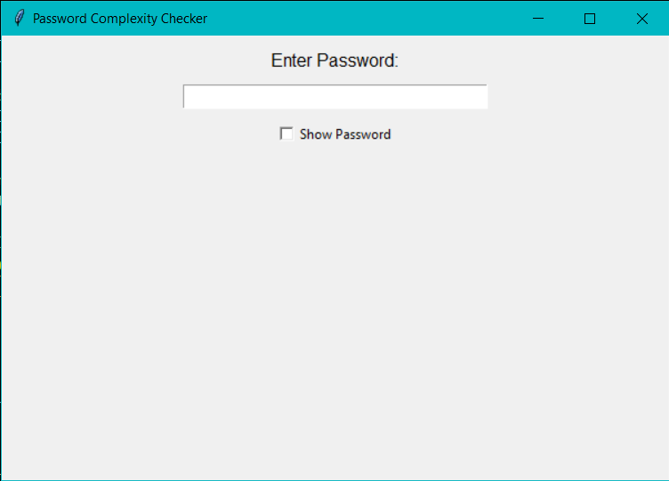

# Password Complexity Checker

A Python-based desktop application that evaluates the strength of a password and provides real-time feedback to users as they type. The application uses a simple Tkinter GUI and checks various password complexity criteria such as length, the presence of uppercase and lowercase letters, numbers, and special characters.

## Features

- **Password Strength Feedback**: Provides live feedback on password strength (Weak, Medium, Strong) based on a set of criteria.
- **Criteria Checked**:
  - Password length (at least 8 characters).
  - Presence of both uppercase and lowercase letters.
  - Inclusion of numbers (0-9).
  - Use of special characters (e.g., `!@#$%^&*`).
- **Show/Hide Password**: Option to toggle the visibility of the password during input.
- **Real-Time Updates**: The password feedback updates instantly as you type.

## GUI Preview

The application features a clean, simple GUI made using Tkinter:



## Installation

To run the project on your local machine, follow the steps below.

### Prerequisites

- **Python 3.x** installed on your system.
- **Tkinter** (typically included with Python installations).

### Steps

1. Clone the repository to your local machine:
    ```bash
    git clone https://github.com/YourUsername/password-complexity-checker.git
    ```

2. Navigate to the project directory:
    ```bash
    cd password-complexity-checker
    ```

3. Run the Python script to start the application:
    ```bash
    python password_checker.py
    ```

4. The application window will appear, centered on your screen, where you can start typing your password to check its strength.

## Usage

- Type a password in the provided input field.
- The application will evaluate the password based on multiple criteria:
  - Length (minimum 8 characters)
  - Uppercase and lowercase letters
  - Numbers (digits)
  - Special characters
- The feedback label will display the password's strength and suggestions for improvement.
- You can check the **"Show Password"** checkbox to view or hide your password.

## Code Highlights

The password evaluation uses Python list comprehensions to streamline the logic for checking password strength:

```python
criteria_checks = [
    len(password) >= 8,  # Check length
    any(c.isupper() for c in password),  # Check uppercase
    any(c.islower() for c in password),  # Check lowercase
    any(c.isdigit() for c in password),  # Check numbers
    any(c in "!@#$%^&*(),.?\":{}|<>" for c in password)  # Check special characters
]
